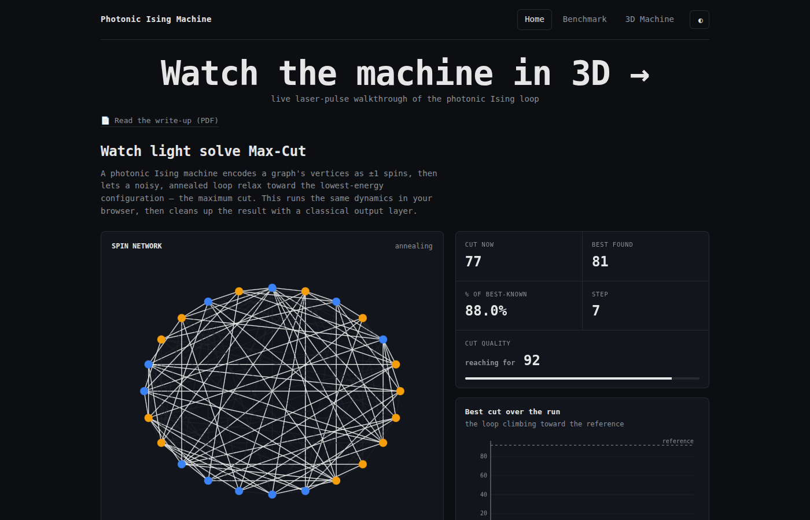
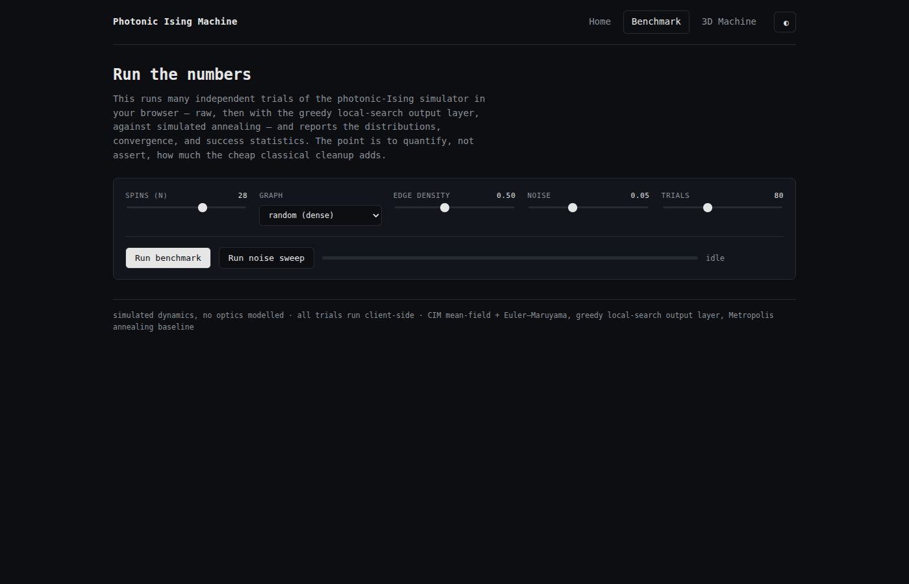
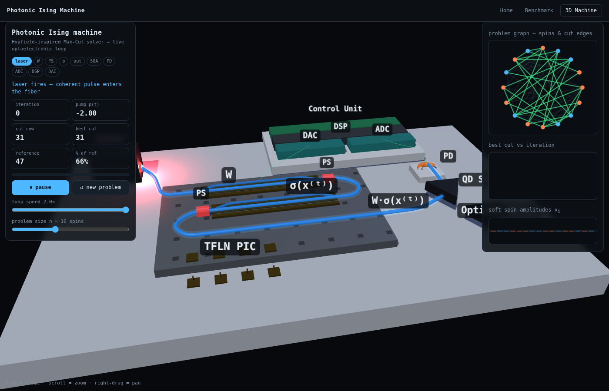

# Photonic-Ising-inspired Max-Cut solver

A from-scratch NumPy simulation of a Coherent-Ising-Machine-style dynamical
system for Max-Cut, a benchmark harness that scores it the way the photonic
hardware papers do, and a classical local-search **output layer** that lifts
the machine's raw solutions.

Motivated by *"Programmable 200 GOPS Hopfield-inspired photonic Ising machine"*
(Nature, 2025). This does **not** model any optics — no waveguides, modulators,
or optoelectronic loop. It models the *computation* the machine performs: an
energy-minimising relaxation whose ground state is the maximum cut.

**Live demo: https://samarthdubey46.github.io/Photonic-Ising-Sim/**

| [Home](https://samarthdubey46.github.io/Photonic-Ising-Sim/index.html) | [Benchmark lab](https://samarthdubey46.github.io/Photonic-Ising-Sim/benchmark.html) | [3D machine walkthrough](https://samarthdubey46.github.io/Photonic-Ising-Sim/machine3d.html) |
|:---:|:---:|:---:|
| [](https://samarthdubey46.github.io/Photonic-Ising-Sim/index.html) | [](https://samarthdubey46.github.io/Photonic-Ising-Sim/benchmark.html) | [](https://samarthdubey46.github.io/Photonic-Ising-Sim/machine3d.html) |

## The bridge from problem to physics

Max-Cut: split a graph's vertices into two sides so the weight of edges
crossing between sides is maximal. Give each vertex a spin `s_i ∈ {-1,+1}`
(which side it's on). Then

```
cut(s) = (1/4) Σ_ij W_ij (1 - s_i s_j) = (1/2)·(total edge weight) - (1/4) s^T W s
```

so **maximising the cut is exactly minimising the Ising energy
`E(s) = (1/2) s^T W s`.** The machine minimises an energy; we pick the energy so
its ground state is our answer. (See `graph.py`; the `+`/`-` sign convention is
chosen so neighbours want to *disagree* — Max-Cut is antiferromagnetic.)

The simulator (`cim.py`) evolves one continuous "soft spin" `x_i` per vertex:

```
dx_i/dt = (-1 + p(t)) x_i  -  x_i^3  -  c (W x)_i  +  noise_i
```

- `(-1+p)x - x^3` is a double well; ramping the pump `p` past threshold is
  **gain annealing**.
- `-c (W x)_i` is the coupling that drives edges to be cut.
- `noise_i` is the paper's key idea: **noise acts as annealing**, helping the
  system escape local minima. Integrated with Euler–Maruyama; readout is
  `sign(x_i)`.

## The three pieces

| file | role |
|------|------|
| `cim.py` | the simulator (CIM mean-field dynamics) |
| `baselines.py` | simulated annealing + random, the references the field uses |
| `postprocess.py` | **output layer**: greedy 1-flip local search to a local optimum |
| `benchmark.py` | success probability, time-to-solution (TTS_99), % of reference |
| `plotting.py` | convergence traces and cut-distribution histograms |

## Headline result

From `python scripts/demo.py` (n = 140 planted graph, scored vs best-known cut):

```
solver                    best    %ref  P_success   TTS_99(s)
CIM (raw)                 2795   82.3%       0.00         inf
CIM + local search        3397  100.0%       1.00       0.092
Simulated annealing       3397  100.0%       1.00       0.142
```

The raw CIM reaches only 82% of the best-known cut and never finds the optimum
on its own. Adding the local-search **output layer** brings it to 100% on every
run — and beats simulated annealing on time-to-solution. On a smaller graph
with the exact optimum known, the output layer raises the per-run success
probability ~9× (0.02 → 0.18).

## Run it

```bash
pip install -r requirements.txt
python scripts/demo.py        # full benchmark + two figures
```

## What's included

```
ising_maxcut/        the library (graph, cim, baselines, postprocess, benchmark, plotting)
scripts/demo.py      end-to-end benchmark + figures
web/index.html       interactive browser demo (open directly or host on GitHub Pages)
web/machine3d.html   3D hardware walkthrough: watch the laser pulse loop through the
                     TFLN PIC → SOA → PD → ADC/DSP/DAC while the real CIM dynamics
                     solve Max-Cut live (three.js from CDN, no build step)
docs/                the write-up (photonic-ising-maxcut.pdf) and its LaTeX source
```

The web demo runs the same CIM + Max-Cut + local search in JavaScript: watch the
cut edges light up as the machine anneals, then hit "Apply output layer" to see
the local-search cleanup close the gap. No build step; drop `web/index.html` at a
repo root or in `/docs` and enable GitHub Pages for a live link.

## Using real Gset benchmarks

`graph.load_gset(path)` reads the standard Gset format (`N M` header, then
`i j w` lines, 1-indexed). Drop a Gset file (e.g. `G1`) next to the script and
score against its best-known cut to compare directly with published numbers.

## Honest limitations / next steps

- The raw CIM is **not tuned** here (fixed coupling, noise, pump schedule). Its
  mediocre raw performance is real — the natural next project is searching the
  **noise/annealing schedule** (Bayesian opt or RL) to lift raw success, which
  is the paper's "noise as annealing" claim made quantitative. Prior art to read
  first: Leleu et al., *amplitude-heterogeneity correction* (PRL 2019).
- The dynamics are mean-field, not a faithful model of the paper's specific
  optoelectronic loop or its DSP step. The post-processor is deliberately built
  to need no such faithful model — it acts on outputs.
- TTS here is wall-clock on one CPU; it measures algorithmic behaviour, not the
  hardware's real speed.
```
